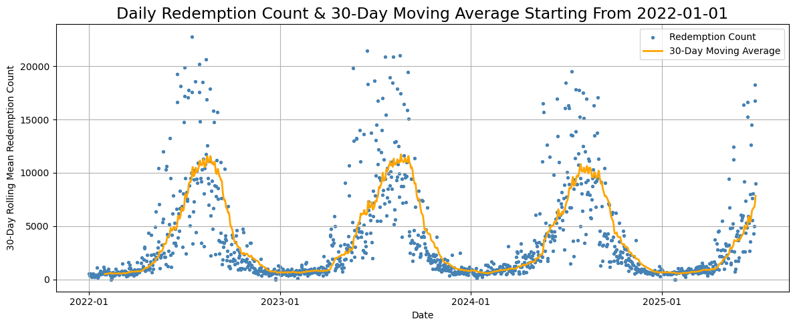
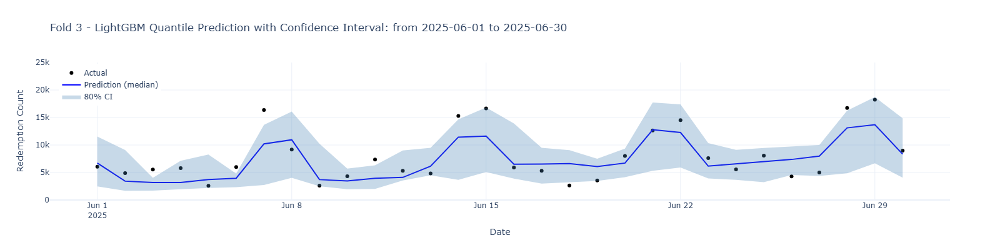
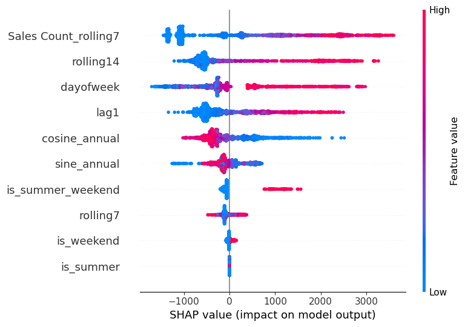
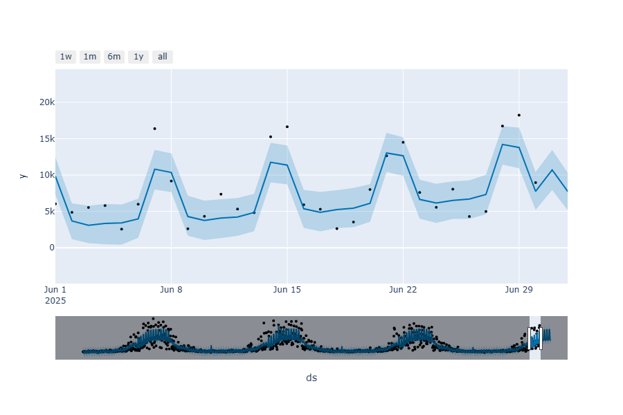
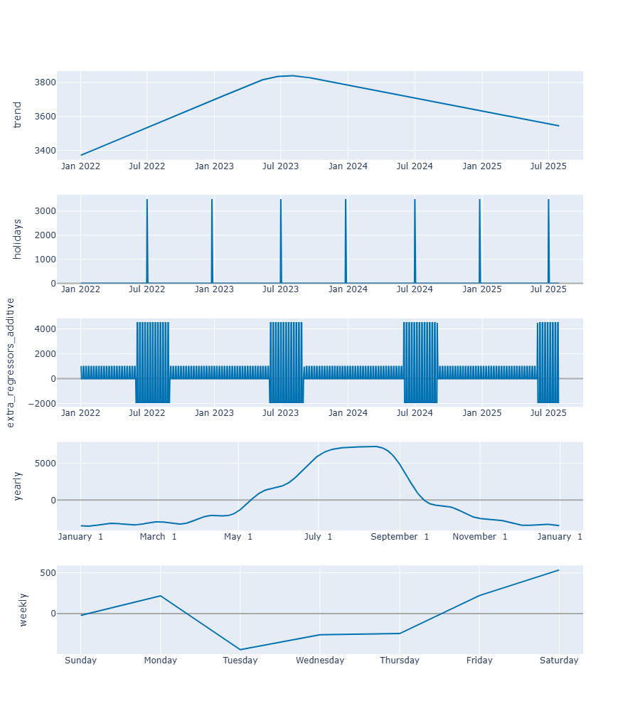

This is a real-world time series forecasting project using daily ferry ticket data from the City of Toronto’s Open Data Portal. The dataset includes ticket sales and redemptions (actual boardings) to the Toronto Islands. The time series exhibits weekly and monthly seasonality, along with sharp peaks during holidays and weekends, and some irregular noise.

# 🎫 Toronto Islands Ferry Redemption Tickets Forecasting (2022–2025)

## 📌 Project Description

This project forecasts daily *Redemption Count* for Toronto Islands ferry services using machine learning and time series techniques. It addresses irregular demand patterns influenced by holidays, weekends, and seasonal tourism surges. The original dataset spans from 2022-01-01 to 2025-06-30, and includes timestamped entries at 15-minute intervals. I've resampled the data into summing up daily counts.

## 💼 Business Value

Accurate forecasts help optimize staffing, ferry schedules, and resource allocation—especially during high-demand summer weekends and public holidays. Planning ahead avoids long queues and service disruptions for both commuters and tourists.

## 📈 Data Overview

Redemption Count: The number of ferry tickets redeemed (i.e., passengers boarding the ferry) during a 15-minute interval.

Sales Count: The number of ferry tickets sold during a 15-minute interval.

These two counts often differ due to advance purchases and no-shows.
To avoid **data leakage**, I've used the following preprocessing step for modeling:

```python
# Shift Sales Count forward by 1 day before applying rolling mean
df['Sales Count_rolling_14'] = df['Sales Count'].shift(1).rolling(window=14).mean()
```

---

## 🧭 Exploratory Data Analysis



- **Clear seasonality**: Demand spikes around summer months (June–August).
- **Weekly patterns**: Higher redemptions on weekends.
- **Challenging extremes**: Sudden spikes and dips due to weather, events, or holidays.
- **Forecasting challenge**: Requires capturing both regular patterns and irregular outliers.

---

## 🌲 LightGBM Forecasting Model

### 🔍 What is LightGBM?

LightGBM (Light Gradient Boosting Machine) is a fast, efficient gradient boosting framework based on decision trees. It differs from XGBoost by:

- Using histogram-based training for speed
- Better handling of large datasets and categorical features
- Providing native support for **quantile regression** to generate confidence intervals

### ✅ Pros

- Fast training
- Handles missing data
- Easy to tune
- Good for irregular, non-linear trends

### ⚠️ Cons

- Harder to interpret than statistical models
- Needs careful cross-validation

---

## ⚙️ Key Techniques Used

- **📅 Feature Engineering**: Flags for `weekend`, `summer`, `summer_weekend`, `holidays`, plus lag and rolling statistics.
- **⏱️ TimeSeriesSplit CV**: Avoids data leakage by preserving temporal order.
- **🧪 Optuna Tuning**: Automatically selected the best `learning_rate`, `num_leaves`, and `max_depth`.
- **📉 Quantile Regression**: Built models for 10th, 50th (median), and 90th percentiles to estimate **80% Confidence Intervals (CI)**.

---

## 📈 LightGBM Quantile Forecast



- **Model**: LightGBM with quantile regression
- **MAE**: 2,179
- **CI Coverage**: 80%
- Captures most weekend peaks, though some spikes remain under-predicted

---

## 🧠 SHAP for Explainability

### What is SHAP?

SHAP (SHapley Additive exPlanations) explains individual predictions by computing each feature’s contribution.

### Use-cases

- Model transparency
- Debugging feature impact
- Justifying predictions to stakeholders

---

## 🔍 SHAP Output for LightGBM



- **Top drivers**:
  - `Sales Count (rolling 7)`, `rolling14`, `dayofweek`
  - Seasonal signals: `cosine_annual`, `sine_annual`
  - Categorical flags: `is_summer`, `is_weekend`, etc.
- **Insight**: Both recent history and calendar effects heavily influence redemption behavior

---

## 📅 Forecasting using Prophet (by Meta)

### 🔎 What is Prophet (by Meta)?

Prophet is a time series model by Meta designed for:

- Strong yearly/weekly seasonality
- Holiday effects
- Human interpretability

### ✅ Pros

- Intuitive decomposition
- Built-in holiday handling
- Good baseline model

---

## ⚙️ Prophet Setup

```python
def add_regressors(df):
    df['dow'] = df['ds'].dt.dayofweek
    df['is_weekend'] = df['dow'].isin([5, 6]).astype(int)
    df['is_summer'] = df['ds'].dt.month.isin([6, 7, 8]).astype(int)
    df['is_summer_weekend'] = df['is_summer'] * df['is_weekend']
    return df

def make_holidays():
    toronto_holidays = pd.DataFrame({
        'holiday': 'canada_holiday',
        'ds': pd.to_datetime([
            '2022-07-01', '2023-07-01', '2024-07-01', '2025-07-01',
            '2022-12-25', '2023-12-25', '2024-12-25', '2025-12-25',
        ]),
        'lower_window': 0,
        'upper_window': 1,
    })
    return toronto_holidays
```

## 📊 Prophet Forecast Output



* **Model**: Prophet with holidays + regressors
* **MAE**: 2017
* Captures smooth seasonal variation and weekends well


## 🔍 Prophet Components



* **Trend**: Slight dip after 2023
* **Holidays**: Canada Day and Christmas have measurable impacts
* **Regressors**: Clear effect of summer weekends
* **Yearly pattern**: Strong summer peak (mid-June to August)
* **Weekly**: Redemption count rises toward the weekend

## ✅ Conclusion

* **LightGBM** excels at irregular pattern detection and provides uncertainty bounds through quantile regression
* **Prophet** offers clean interpretability and solid baseline performance
* **Best Practice**: Use both approaches in tandem - Prophet for trend/seasonality and LightGBM for residual complexity
* **Next Steps**: Consider hybrid modeling (e.g., residual correction) or ensemble forecasting
